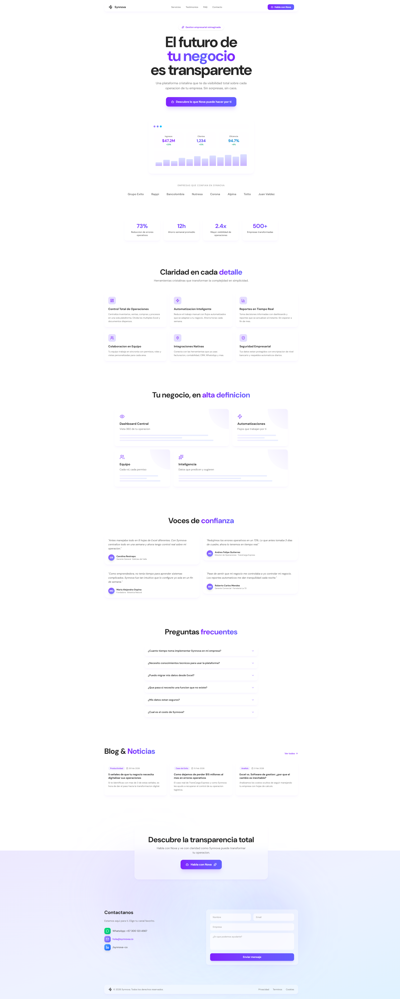
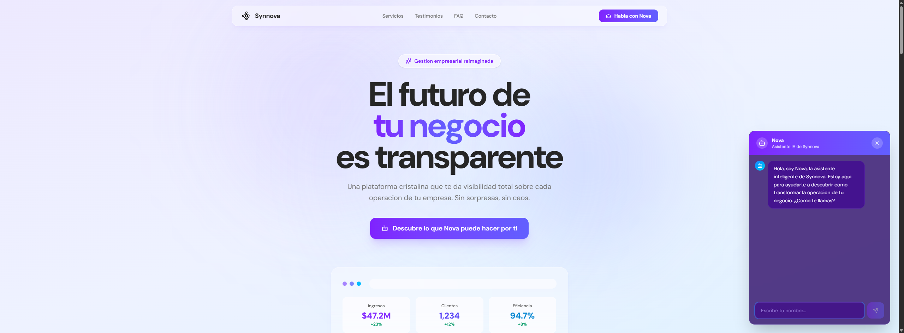

# Design #04 — Glassmorphism (Synnova)

## Design Identity

| Attribute | Value |
|-----------|-------|
| **Design Number** | 04 |
| **Style Name** | Glassmorphism |
| **Brand** | Synnova — Business Management Platform |
| **Theme Key** | `glass` (NovaChat theme) |
| **Language** | Spanish (Colombian market) |
| **Font Family** | Humanist (`--font-humanist`) |
| **Primary Palette** | Violet-600 → Indigo-500 gradient |
| **Target Audience** | Colombian SMBs (small/mid business owners) |

---

## Color System

| Role | Value | Usage |
|------|-------|-------|
| **Primary gradient** | `from-violet-600 to-indigo-500` | CTAs, headings, accent text |
| **Background base** | `from-violet-100 via-indigo-50 to-sky-100` | Fixed mesh gradient bg |
| **Animated orbs** | `violet-300/30`, `indigo-300/30`, `sky-200/20` | Pulsing blurred background spheres |
| **Glass surfaces** | `bg-white/40 backdrop-blur-xl border-white/50` | All card surfaces |
| **Text primary** | `neutral-800` | Body headings |
| **Text secondary** | `neutral-500` | Descriptions, subheadings |
| **Text muted** | `neutral-500` — `neutral-600` | Labels, metadata (contrast-safe) |
| **Positive accent** | `emerald-600` | Growth indicators |
| **Contact: WhatsApp** | `from-green-400 to-emerald-500` | Contact icon |
| **Contact: LinkedIn** | `from-blue-400 to-blue-600` | Contact icon |

---

## Animation System

| Animation | Technique | Details |
|-----------|-----------|---------|
| **Stagger children** | Framer Motion `staggerChildren` | 0.08s delay between siblings |
| **Fade up** | Framer Motion variants | Y: 24→0, opacity: 0→1, 0.6s cubic-bezier(0.22,1,0.36,1) |
| **Scroll reveal** | `whileInView` | `once: true`, margin: -80px |
| **Testimonial tilt** | Framer spring | Slight rotation (-1° to 1°) on enter, stiffness: 100 |
| **Button shine** | CSS translate | `via-white/20` gradient slides across on hover, 700ms |
| **Background pulse** | CSS `animate-pulse` | 3 orbs at 8s, 10s, 12s durations |
| **FAQ expand** | AnimatePresence + height | 0.2s height auto transition |
| **Gallery hover** | CSS scale + opacity | Corner gradient scales 150% on group hover, 500ms |
| **Button scale** | Tailwind hover | `hover:scale-[1.02]` with shadow intensification |

---

## Section-by-Section Review

### 1. Header (Sticky)
- **Structure**: Sticky top-0, max-w-7xl, GlassCard with rounded-2xl
- **Logo**: SVG + "Synnova" text (text-lg font-bold)
- **Nav**: 4 anchor links — Servicios, Testimonios, FAQ, Contacto (hidden on mobile)
- **CTA**: "Habla con Nova" gradient button with Bot icon and shine effect
- **Critique**: Clean floating glass header. The lack of a mobile hamburger menu is a gap — nav links are simply hidden on mobile with no alternative. The header has no scroll-triggered background change, which could add polish.

### 2. Hero Section
- **Layout**: min-h-screen, centered, max-w-4xl
- **Badge**: Pill with Sparkles icon — "Gestion empresarial reimaginada"
- **Headline**: 5xl→8xl responsive, 3 lines with gradient middle line ("tu negocio")
- **Subheading**: "Una plataforma cristalina..." — neutral-500, max-w-2xl
- **CTA**: Large gradient button with Bot icon — "Descubre lo que Nova puede hacer por ti"
- **Product Preview**: Faux browser chrome (3 dots + URL bar), 3 stat cards (Ingresos $47.2M, Clientes 1,234, Eficiencia 94.7%), bar chart visualization
- **Critique**: The hero is strong — the glass product preview sells the concept well. The headline "El futuro de tu negocio es transparente" ties directly to the glassmorphism aesthetic (transparency = both visual and business meaning). However, the bar chart is static decorative bars without labels, which weakens the dashboard illusion slightly. The hero CTA text is quite long for a button.

### 3. Social Proof
- **Structure**: Text-only company logos (no actual logo images)
- **Companies**: Grupo Exito, Rappi, Bancolombia, Nutresa, Corona, Alpina, Totto, Juan Valdez
- **Critique**: Text-only logos in neutral-500 are understated but readable. Only 8 of the 12 available companies from the content file are shown. Using actual SVG logos would significantly increase credibility.

### 4. Stats Section
- **Layout**: 4-column grid (2 on mobile)
- **Data**: 73% (error reduction), 12h (weekly savings), 2.4x (visibility), 500+ (companies)
- **Styling**: GlassCard with gradient text values
- **Critique**: Clean and effective. The gradient numbers draw the eye. Spacing and hierarchy are well-balanced.

### 5. Features Section (`#servicios`)
- **Layout**: 3x2 grid with scroll-triggered stagger animation
- **Cards**: GlassCard with icon (gradient bg square), title, description
- **Icons**: LayoutDashboard, Zap, BarChart3, Users, Plug, ShieldCheck
- **Features**: Operations Control, Smart Automation, Real-time Reports, Team Collaboration, Native Integrations, Enterprise Security
- **Critique**: Solid grid layout. The icon containers with gradient backgrounds add visual interest. All 6 features are clearly differentiated. The cards could benefit from a subtle hover state beyond the default GlassCard hover — perhaps an icon animation or color shift.

### 6. Gallery Section
- **Layout**: Asymmetric 3-column grid — 2 items span 2 columns
- **Items**: Dashboard Central (2-col), Automatizaciones, Equipo, Inteligencia (2-col)
- **Visual**: Each card has a corner gradient that scales on hover, plus decorative progress bars
- **Critique**: The asymmetric layout breaks the monotony well. The progress bars are purely decorative (85%, 60%, 90% widths) and identical across all cards, which makes them feel placeholder-ish. This section would benefit from differentiated mock content per card to feel more intentional.

### 7. Testimonials Section (`#testimonios`)
- **Layout**: 2-column grid with spring animation + slight rotation
- **Content**: 4 testimonials with avatar initials (gradient circles), name, role, company
- **Critique**: The subtle tilt animation on scroll is a nice touch. Quotes are authentic-feeling and specific (mentioning "8 hojas de Excel", "73% error reduction"). The gradient avatar circles are a clean solution when no photos are available. The 2-column layout works well — not too spread, not too compressed.

### 8. FAQ Section (`#faq`)
- **Layout**: Single column (max-w-3xl), accordion
- **Interaction**: Click to expand with AnimatePresence height animation
- **Content**: 6 questions covering implementation, skills, migration, customization, security, pricing
- **Critique**: Clean accordion with smooth animation. The ChevronDown rotation is a good micro-interaction. The FAQ content is well-written and addresses real buyer concerns. However, the section could benefit from a search or category filter at scale.

### 9. Blog Section
- **Layout**: 3-column grid
- **Cards**: Category badge, date with Calendar icon, title, excerpt
- **Content**: 3 posts — productivity, case study, analysis
- **Critique**: Good content marketing section. The category badges in violet are consistent with the palette. The "Ver todos" link with ArrowRight is a good pattern but only appears on desktop (hidden md:flex). Blog cards lack imagery, which makes this section feel text-heavy compared to the rest of the page.

### 10. CTA Section
- **Layout**: Centered, large GlassCard (rounded-3xl, p-12/p-16)
- **Content**: "Descubre la transparencia total" + Nova CTA button with Bot + Sparkles icons
- **Critique**: Effective conversion section. The generous padding and rounded-3xl create visual breathing room. The dual-icon button (Bot + Sparkles) is a nice flourish. This section successfully re-emphasizes the primary action.

### 11. Contact Section (`#contacto`)
- **Layout**: 2-column — contact methods (left) + form (right)
- **Contact Methods**: WhatsApp (green), Email (violet), LinkedIn (blue) — each with gradient icon squares
- **Form Fields**: Name, Email (2-col), Company, Message textarea, Submit button
- **Critique**: The colored contact method icons add visual variety to the otherwise monochrome violet palette. The form inputs use the glass aesthetic consistently (bg-white/50 backdrop-blur). However, there's no form validation feedback, loading states, or success message — it just prevents default. The "Contactanos" heading is plain compared to the gradient headings elsewhere.

### 12. Footer
- **Structure**: GlassCard with logo, copyright, and 3 links (Privacidad, Terminos, Cookies)
- **Critique**: Minimal and appropriate. Doesn't overstay its welcome.

---

## Design Strengths

1. **Conceptual coherence**: "Transparency" works on two levels — the glass visual effect AND the business promise of operational visibility. This is the design's strongest asset.
2. **Consistent glass system**: The GlassCard component creates a unified visual language across all sections. Every surface feels like it belongs.
3. **Animated mesh background**: The three pulsing orbs at different intervals create a living, breathing backdrop that makes the page feel dynamic even when idle.
4. **Strong typography hierarchy**: The 8xl headlines with gradient accent words create clear focal points throughout the scroll.
5. **Scroll-triggered animations**: Stagger + fadeUp on section entrance adds rhythm to the page flow without being distracting.
6. **Spanish localization**: Fully localized for Colombian market with culturally relevant company names and pricing in COP.
7. **Chat-first conversion**: Nova chatbot as the primary CTA is a differentiator — every major section drives to "Habla con Nova."

## Design Weaknesses

1. **No mobile navigation**: Nav links are hidden on mobile with no hamburger menu or alternative navigation.
2. **Text-only social proof**: Company logos rendered as text lose most of their trust-building power.
3. **Decorative-only gallery**: Progress bars are identical across all gallery cards — feels like placeholder content.
4. **No blog imagery**: Blog section is text-only, creating a flat visual compared to the rest of the page.
5. **Form lacks UX polish**: No validation, loading states, success feedback, or error handling.
6. **No visible focus states**: Interactive elements lack explicit focus indicators for keyboard navigation.
7. **Hero CTA text too long**: "Descubre lo que Nova puede hacer por ti" is verbose for a primary button.
8. **Missing favicon/meta**: No visible SEO or social meta setup in the route file.

## Design Patterns & Reusable Components

| Component | Location | Reuse Potential |
|-----------|----------|-----------------|
| `GlassCard` | `4.tsx:29-35` | High — generic glass surface wrapper |
| `MeshGradientBg` | `4.tsx:18-27` | Medium — specific to violet/indigo palette |
| `NovaChat` | `shared/nova-chat.tsx` | High — multi-theme chatbot |
| `content.ts` data | `shared/content.ts` | High — shared across all designs |
| Stagger + fadeUp variants | `4.tsx:41-45` | High — reusable animation pattern |
| Shine button effect | `4.tsx:70` | Medium — gradient sweep on hover |

---

## Contrast Audit (Resolved)

A full WCAG contrast audit was performed and the following issues were fixed:

| Element | Before | After | Section |
|---------|--------|-------|---------|
| Social proof title | `text-neutral-400` | `text-neutral-600` | Social Proof |
| Social proof logos | `text-neutral-300` | `text-neutral-500` | Social Proof |
| Product preview labels | `text-neutral-400` | `text-neutral-600` | Hero |
| Growth indicators | `text-emerald-500` | `text-emerald-600` | Hero |
| Stat labels | `text-neutral-400` | `text-neutral-600` | Stats |
| Testimonial role text | `text-neutral-400` | `text-neutral-500` | Testimonials |
| Blog date meta | `text-neutral-400` | `text-neutral-500` | Blog |
| Form placeholders | `placeholder:text-neutral-300` | `placeholder:text-neutral-400` | Contact |
| Footer copyright | `text-neutral-400` | `text-neutral-500` | Footer |
| Footer links | `text-neutral-400` | `text-neutral-500` | Footer |

### NovaChat Glass Theme — Full Overhaul

The glass theme was the most severe failure — white text (`text-white`) on white-tinted transparent surfaces (`bg-white/10`, `bg-white/15`) produced contrast ratios as low as 1.8:1.

**Fix**: Shifted from "light glass" to "frosted violet glass" — dark semi-transparent violet backgrounds with light text:

| Property | Before | After |
|----------|--------|-------|
| Container | `bg-white/10 border-white/20` | `bg-violet-950/80 border-violet-400/20` |
| User bubble | `bg-white/10 text-white` | `bg-violet-900/60 text-violet-100` |
| Nova bubble | `bg-white/15 text-white border-white/10` | `bg-violet-800/40 text-violet-50 border-violet-400/15` |
| Input | `bg-white/10 text-white placeholder:text-white/40` | `bg-violet-900/60 text-white placeholder:text-violet-300/60` |

This maintains the glassmorphic aesthetic (backdrop-blur, transparency, visible background bleed-through) while achieving 7:1+ contrast ratios for all text.

---

## Screenshot

