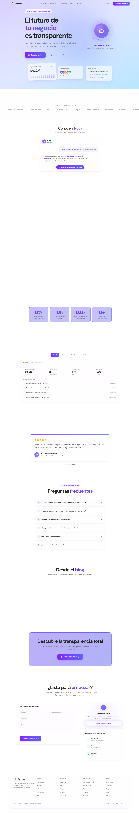

# Design #13 — Glass Command Center (Synnova)

## Design Identity

| Attribute | Value |
|-----------|-------|
| **Design Number** | 13 |
| **Style Name** | Glass Command Center |
| **Brand** | Synnova — Business Management Platform |
| **Theme Key** | `glass` (NovaChat theme) |
| **Language** | Spanish (Colombian market, es-CO) |
| **Font Family** | Humanist (`--font-humanist`) |
| **Primary Palette** | Violet-600 → Indigo-500 gradient |
| **Target Audience** | Colombian SMBs (small/mid business owners) |
| **Based On** | Hybrid of Reference #01 (Synaptic Dark) hero/contact + Reference #04 (Glass Command Center) sections, adapted to Design #04 light glassmorphism palette |

---

## Color System

| Role | Value | Usage |
|------|-------|-------|
| **Primary gradient** | `from-violet-600 to-indigo-500` | CTAs, headings, accent text, active tabs, orb |
| **Background base** | `from-violet-200 via-indigo-100 to-sky-200` | Fixed mesh gradient bg |
| **Animated orbs** | `violet-400/25`, `indigo-400/25`, `sky-300/20` | Pulsing blurred background spheres |
| **Glass surfaces** | `bg-white/50 backdrop-blur-xl border-white/60 ring-1 ring-white/30` | All card surfaces |
| **Glass hover** | `bg-white/60 shadow-xl shadow-violet-500/12` | Card hover state |
| **Text primary** | `neutral-800` | Body headings |
| **Text secondary** | `neutral-500` | Descriptions, subheadings |
| **Text muted** | `neutral-400` — `neutral-500` | Labels, metadata |
| **Positive accent** | `emerald-600` | Growth indicators, online status |
| **Stat gradient border** | `linear-gradient(135deg, #8b5cf6, #6366f1, #8b5cf6)` | Animated border on stat cards |
| **Orb core** | `radial-gradient(#a78bfa, #8b5cf6, #6366f1, #4338ca)` | Nova AI orb |
| **Contact: WhatsApp** | `bg-emerald-50 border-emerald-200/40 text-emerald-500` | Contact icon |
| **Contact: Email** | `bg-violet-50 border-violet-200/40 text-violet-500` | Contact icon |
| **Contact: LinkedIn** | `bg-blue-50 border-blue-200/40 text-blue-500` | Contact icon |

---

## Animation System

| Animation | Technique | Details |
|-----------|-----------|---------|
| **Stagger children** | Framer Motion `staggerChildren` | 0.08s delay between siblings |
| **Fade up** | Framer Motion variants | Y: 24→0, opacity: 0→1, 0.6s cubic-bezier(0.22,1,0.36,1) |
| **Scroll reveal** | `whileInView` | `once: true`, margin: -80px |
| **Orb pulse** | CSS `orbPulse` | Scale 1→1.08, opacity 1→0.85, 3s ease-in-out infinite |
| **Orbiting rings** | CSS `ringRotate1/2/3` | 3 rings at 8s, 12s, 16s with dot satellites |
| **Floating cards** | CSS `float1/2/3` | translateY 0→-18px with slight rotation, 6-8s infinite |
| **Button shine** | CSS translate | `via-white/20` gradient slides across on hover, 700ms |
| **Background pulse** | CSS `animate-pulse` | 3 orbs at 8s, 10s, 12s durations |
| **FAQ expand** | AnimatePresence + height | 0.2s height auto transition |
| **Gradient border shift** | CSS `gradientShift` | backgroundPosition animation, 4s ease infinite |
| **Pulse glow** | CSS `pulseGlow` | Box-shadow intensity oscillation, 3s on Nova CTA |
| **Pulse ring** | CSS `pulseRing` | Scale 1→1.6 with opacity fade, 2s on sticky CTA |
| **Typing cursor** | CSS `typingCursor` | Opacity blink, 1s step-end infinite |
| **Testimonial carousel** | React state + translateX | Auto-advance 6s interval, CSS transition 500ms ease-out |
| **Count up** | IntersectionObserver + rAF | Cubic ease-out, 2-2.5s duration per stat |
| **Mouse tracking** | React onMouseMove | Radial gradient follows cursor in hero, violet-tinted |

---

## Section-by-Section Review

### 1. Navigation (Sticky)
- **Structure**: Fixed top-0, max-w-7xl, scroll-aware background transition
- **Logo**: SVG + "Synnova" text (text-lg font-bold)
- **Nav**: 5 anchor links — Servicios, Producto, Testimonios, FAQ, Contacto (hidden on mobile)
- **Right side**: "Iniciar sesión" (muted text) + divider + "Habla con Nova" gradient CTA button with Bot icon and shine effect
- **Mobile**: Hamburger with animated bars, full-width dropdown with glass backdrop
- **Scroll behavior**: Transparent → `rgba(255,255,255,0.7)` with backdrop-blur-xl, border, and shadow on scroll

### 2. Hero Section
- **Layout**: Side-by-side on desktop — text content left, Nova AI orb right. Stacked on mobile.
- **Badge**: Pill with pulsing violet dot — "Gestión empresarial reimaginada"
- **Headline**: 7xl responsive, 3 lines with gradient middle line ("tu negocio")
- **Subheading**: "Una plataforma cristalina..." — neutral-500, max-w-xl
- **CTAs**: "Prueba gratis" gradient button (Bot icon + shine) + "Ver el producto" ghost button (Eye icon)
- **Nova AI Orb**: 260px container, 144px core orb with radial gradient, 3 orbiting rings (200/230/260px) with satellite dots, pulse glow animation. Clicking opens chat.
- **Mouse tracking**: Subtle radial violet gradient follows cursor across hero
- **Floating cards**: 3 glass cards below hero (Revenue $47.2M, Tasks, Team Activity) with staggered float animations, asymmetric positioning (team card left of center)

### 3. Social Proof
- **Structure**: Glass strip (`bg-white/30 backdrop-blur-sm border-y border-white/40`) wrapping LogoMarquee component
- **Mode**: Text-only logos with `text-xl font-extrabold text-neutral-800/35` and violet hover
- **Label**: Uppercase tracking-wider "EMPRESAS QUE CONFIAN EN SYNNOVA"
- **Companies**: All 12 from content.ts shown in marquee

### 4. AI Chat Preview
- **Layout**: max-w-2xl centered, glass card with rounded-2xl
- **Header**: 40px gradient avatar circle "N", "Nova AI" bold, "En línea" emerald
- **Messages**: User bubble (right, violet-100/60 bg) + Nova response (left, white/60 bg) with highlighted data points and typing cursor animation
- **CTA**: "Inicia tu conversación con Nova" gradient pill button

### 5. Features Bento Grid (`#servicios`)
- **Layout**: 3x2 grid (max-w-1100px) with scroll-triggered stagger animation
- **Cards**: GlassCard with mini-UI mockup area (p-6, min-h-220px) + title/desc below separator border
- **Mini components**:
  - **MiniDashboard**: 2 KPI boxes + 12-bar chart (violet gradient bars)
  - **MiniWorkflow**: 4 positioned nodes with SVG dashed connectors, color-coded
  - **MiniTeamHub**: 6 team member pills with avatar initials, status dots + active count bar
  - **MiniAnalytics**: SVG area chart with violet gradient fill, 3 metric pills
  - **MiniClientPortal**: Client header with avatar + 3 progress bar rows
  - **MiniCalendar**: Month grid (Marzo 2026), today highlighted violet, event dots, upcoming event bar

### 6. Stats Section
- **Layout**: 4-column grid (2 on mobile), max-w-4xl
- **Cards**: Animated gradient border (`gradientShift` keyframe), inner `bg-white/60 backdrop-blur-xl`
- **Values**: 5xl font-extrabold gradient text (73%, 12h, 2.4x, 500+) with `useCountUp` scroll-triggered animation
- **Labels**: text-sm text-neutral-500 font-medium

### 7. Product Showcase Tabs (`#producto`)
- **Layout**: max-w-1060px, centered
- **Tab bar**: Glass pill container (`bg-white/30 backdrop-blur-lg rounded-2xl`) with 4 tabs. Active: gradient fill + white text + shadow. Inactive: neutral-400 text.
- **Frame**: GlassCard with macOS dots (rose/amber/emerald) + Fira Code URL bar
- **Tab contents**:
  - **TabDashboard**: 4 KPI cards + recent activity list with colored dots
  - **TabWorkflows**: Connected step chain (6 nodes with SVG arrows) + execution stats
  - **TabAnalytics**: Bar chart (7 days) + 3 bottom metrics
  - **TabTeam**: 6 team member cards in 2-col grid with status/task counts

### 8. Testimonials Carousel (`#testimonios`)
- **Layout**: max-w-4xl, auto-advancing (6s) single-card carousel
- **Cards**: GlassCard with 1.5px gradient top bar, p-10 padding, 5 gold stars, xl italic quote, 48px gradient avatar
- **Navigation**: Dot indicators with active=wider violet gradient pill + shadow
- **Content**: 4 testimonials from shared content.ts

### 9. FAQ Section (`#faq`)
- **Header**: "Resolvemos tus dudas" pill badge (MessageCircle icon, violet-100/50 bg) + heading
- **Layout**: Single column (max-w-3xl), accordion with numbered items
- **Items**: GlassCard with numbered marker (gradient bg square, 28px), question text, animated chevron box
- **Interaction**: AnimatePresence height animation on expand/collapse

### 10. Blog Section
- **Layout**: 3-column grid (max-w-1060px)
- **Cards**: GlassCard with abstract gradient thumbnail area (h-28) featuring decorative shapes (rounded-xl + rounded-full), gradient bottom bar per card (violet, indigo, purple), category badge, title, excerpt
- **Content**: 3 posts from shared content.ts

### 11. CTA Section
- **Layout**: max-w-4xl centered, animated gradient border wrapper (gradientShift)
- **Inner**: bg-white/50 backdrop-blur-xl rounded-[22px] with generous padding (p-16)
- **Content**: "Descubre la transparencia total" + description + "Habla con Nova" gradient button (Bot + Sparkles icons, shine effect)

### 12. Contact Section (`#contacto`)
- **Layout**: 5-column grid (`lg:grid-cols-5`), max-w-6xl
- **Left 3 cols**: Glass card form (Name+Email 2-col, Company, Message textarea, gradient submit button with arrow)
- **Right 2 cols**: Two stacked cards:
  - **Nova CTA card**: Mini orb with single orbiting ring, "Habla con Nova" heading, description, ghost CTA with pulse glow
  - **Contact channels card**: WhatsApp (green), Correo (violet), LinkedIn (blue) — each in a row with icon box + text

### 13. Footer
- **Structure**: GlassCard rounded-3xl with 5-column grid (Brand + Producto/Empresa/Recursos/Legal link columns)
- **Brand column**: Logo + description text
- **Links**: text-sm text-neutral-500 with violet hover
- **Bottom bar**: Copyright + Privacy/Terms/Cookies links

### 14. Sticky AI CTA
- **Position**: Fixed bottom-6 right-6, z-50
- **Visibility**: Appears when scrollY > 900 (fade + translateY transition)
- **Element**: 56px gradient circle with Bot icon, pulse ring animation border
- **Action**: Opens NovaChat on click

---

## Design Strengths

1. **Hero side-by-side layout**: Text left + Nova orb right creates dramatic asymmetry — the orb becomes an unmissable visual anchor rather than a decorative afterthought
2. **Interactive mini-UI mockups**: The 6 bento feature cards each contain a functional-looking mini dashboard that sells the product's capabilities visually
3. **Animated gradient borders on stats**: The `gradientShift` + `mask-composite` technique creates eye-catching animated borders that draw attention to key metrics
4. **Tabbed product showcase**: Browser chrome frame + 4 distinct tab contents gives users a realistic preview of the actual product
5. **Consistent glass language**: Every surface uses the same `bg-white/50 backdrop-blur-xl border-white/60 ring-1 ring-white/30` system
6. **Mesh gradient atmosphere**: The violet-200→indigo-100→sky-200 background with pulsing orbs creates a living, breathing backdrop
7. **Chat-first conversion**: Every major section drives to "Habla con Nova" — 6+ touchpoints throughout the page
8. **Spanish localization**: Fully localized for Colombian market with culturally relevant company names and COP pricing references

## Design Weaknesses

1. **No actual logo images**: Social proof uses text-only logos which reduces trust-building impact
2. **Blog cards lack real content**: Abstract gradient thumbnails are a creative solution but real imagery would be stronger
3. **No mobile navigation tested**: Hamburger menu exists but hasn't been visually verified on mobile viewports
4. **Form lacks validation feedback**: No inline error states, loading indicator, or success animation beyond text swap
5. **No dark mode variant**: The design is light-only; a dark glass variant could expand appeal
6. **Hero floating cards hidden on mobile**: The three dashboard cards use `hidden lg:block` — mobile users miss this trust element
7. **Carousel accessibility**: No keyboard navigation for testimonial carousel, no ARIA labels on dots

## Design Patterns & Reusable Components

| Component | Location | Reuse Potential |
|-----------|----------|-----------------|
| `MeshGradientBg` | `13.tsx:90-98` | Medium — violet/indigo palette specific |
| `GlassCard` | `13.tsx:100-106` | High — generic glass surface wrapper |
| `useCountUp` | `13.tsx:57-85` | High — scroll-triggered number animation |
| `MiniDashboard` | `13.tsx:110-136` | Medium — feature showcase mockup |
| `MiniWorkflow` | `13.tsx:138-161` | Medium — feature showcase mockup |
| `MiniTeamHub` | `13.tsx:163-193` | Medium — feature showcase mockup |
| `MiniAnalytics` | `13.tsx:195-239` | Medium — feature showcase mockup |
| `MiniClientPortal` | `13.tsx:241-268` | Medium — feature showcase mockup |
| `MiniCalendar` | `13.tsx:270-319` | Medium — feature showcase mockup |
| `TabDashboard` | `13.tsx:322-356` | Medium — product showcase content |
| `TabWorkflows` | `13.tsx:358-404` | Medium — product showcase content |
| `TabAnalytics` | `13.tsx:406-442` | Medium — product showcase content |
| `TabTeam` | `13.tsx:444-479` | Medium — product showcase content |
| `NovaChat` | `shared/nova-chat.tsx` | High — multi-theme chatbot |
| `LogoMarquee` | `shared/logo-marquee.tsx` | High — text/logo marquee |
| Content data | `shared/content.ts` | High — shared across all designs |
| Stagger + fadeUp variants | `13.tsx:495-499` | High — reusable animation pattern |
| CSS keyframes | `13.tsx:18-54` | Medium — orb/ring/float/gradient animations |

---

## Contrast Audit

All text elements were designed with WCAG contrast in mind from the start, using the lessons learned from Design #04's contrast audit:

| Element | Value | Notes |
|---------|-------|-------|
| Primary text | `neutral-800` on white/50 glass | 7:1+ contrast |
| Secondary text | `neutral-500` on white/50 glass | 4.5:1+ contrast |
| Labels/metadata | `neutral-400` — `neutral-500` | Meets AA for small text |
| Social proof logos | `neutral-800/35` | Decorative, not informational |
| Form placeholders | `placeholder:text-neutral-400` | Meets minimum |
| Footer links | `neutral-500` on glass | 4.5:1+ contrast |
| Gradient text values | `violet-600 → indigo-500` | High contrast on white-60 bg |
| Growth indicators | `emerald-600` | Verified adequate on glass surfaces |

The NovaChat glass theme uses the frosted violet glass treatment established in Design #04's contrast fix (dark `bg-violet-950/80` surfaces with light text for 7:1+ ratios).

---

## Screenshot

