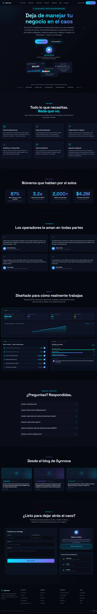

# Design #01 — Synaptic Dark

> Cyberpunk Neural Network Landing Page

## Visual Identity / Aesthetic

Synaptic Dark is a cyberpunk-inspired, ultra-dark landing page with a neural network motif. The design evokes a high-tech command center aesthetic — deep space blacks punctuated by electric cyan and violet accents. The overall mood is futuristic, technical, and premium. Decorative elements include floating neural network nodes, animated gradient meshes, grid overlays, scanline effects, and orbiting ring animations around an AI "orb" element.

## Color Palette

| Role | Color | Hex |
|------|-------|-----|
| Background (base) | Near-black | `#06080f` |
| Background (cards/panels) | Dark navy | `rgba(15, 23, 42, 0.6)` – `rgba(15, 23, 42, 0.8)` |
| Primary accent | Electric cyan | `#00e5ff` |
| Secondary accent | Violet/purple | `#8b5cf6` |
| Body text | Light slate | `#e2e8f0` |
| Secondary text | Muted slate | `#94a3b8` |
| Tertiary text | Dark slate | `#64748b` |
| Subtle borders | Cyan-tinted | `rgba(0, 229, 255, 0.06)` – `rgba(0, 229, 255, 0.25)` |
| Success green | Emerald | `#10b981` |
| Warning amber | Amber | `#f59e0b` |
| Error red | Red | `#ef4444` |

Primary gradient: `linear-gradient(135deg, #00e5ff, #8b5cf6)` — used for CTAs, stat values, avatar badges, and decorative elements.

## Typography

| Element | Font | Weight | Size |
|---------|------|--------|------|
| Headings | Space Grotesk | 700 (bold) | `clamp(36px, 6vw, 68px)` hero; `3xl`–`5xl` sections |
| Section labels | JetBrains Mono | 500 | `text-sm`, uppercase, tracked wide |
| Body text | Inter | 400 | `text-sm` – `text-xl` |
| Nav links | Inter | 400 | `text-sm` |
| CTA buttons | Space Grotesk | 600 | `text-sm` – `text-base` |

The monospace font (JetBrains Mono) is used exclusively for section category labels (e.g., "funciones", "resultados") to reinforce the technical/developer aesthetic. Space Grotesk provides a modern geometric feel for all headings and branded elements.

## Layout Patterns and Grid System

- **Max widths**: `max-w-7xl` (1280px) for full sections, `max-w-6xl` for stats, `max-w-5xl` for hero content, `max-w-3xl` for FAQ
- **Grid**: CSS Grid with responsive columns — `grid-cols-1 md:grid-cols-2 lg:grid-cols-3` for features; `grid-cols-2 lg:grid-cols-4` for stats; `grid-cols-1 lg:grid-cols-2` for testimonials; `grid-cols-1 lg:grid-cols-5` (3+2 split) for contact
- **Spacing**: Generous vertical padding per section — `py-24 sm:py-32` (96px–128px), `px-4 sm:px-6 lg:px-8`
- **Section dividers**: Subtle horizontal gradient lines (`transparent → accent → transparent`) between every section, no hard borders

## Sections — Detailed Breakdown

---

### 1. Navigation

- **Position**: Fixed top, full-width, `z-50`
- **Scroll behavior**: Transparent background + no blur → on scroll >40px transitions to `rgba(6, 8, 15, 0.85)` background with `blur(20px) saturate(1.5)` and a `1px solid rgba(0, 229, 255, 0.08)` bottom border. Padding shrinks from `py-5` to `py-3`
- **Layout**: `max-w-7xl` centered, flexbox `justify-between`
- **Left**: SynnovaLogo component (30px, cyan) + "Synnova" wordmark in Space Grotesk 18px semibold
- **Center** (desktop): 7 nav links — Funciones, Resultados, Testimonios, Producto, Preguntas, Blog, Contacto — in Inter 14px, `#94a3b8` text, hover to `#00e5ff`
- **Right** (desktop): "Iniciar sesión" text link + "Prueba gratis" gradient pill button (`rounded-full`, `px-5 py-2.5`, gradient bg with `box-shadow: 0 0 20px rgba(0,229,255,0.25)`, hover `scale-105`)
- **Mobile**: Hamburger icon (3 animated bars that rotate into an × on open), slide-down overlay menu at `rgba(6, 8, 15, 0.97)` with `blur(20px)`, vertical link stack + full-width gradient CTA

---

### 2. Hero Section

- **Height**: `min-h-screen` with centered content, `pt-24 pb-16 px-4`
- **Background layers** (stacked):
  1. Animated gradient mesh — `linear-gradient(135deg)` with 6 stops cycling position over 400% area at `opacity: 0.4`, `animation: gradientMesh 20s`
  2. 18 neural network nodes — small circles (3–9px) in cyan/violet/navy, absolutely positioned with `nodeFloat` animation (3–5s, staggered delays)
  3. Mouse-tracking radial gradient — 600px circle following cursor at `rgba(0, 229, 255, 0.06)`
  4. Grid overlay — 60px CSS grid at `opacity: 0.03` in cyan
- **Content** (centered, `max-w-5xl`, staggered `fadeInUp` with 0.15s increments):
  1. **Badge pill**: Cyan-bordered rounded-full pill with pulsing green dot + "YA EN BETA ABIERTA — MÁS DE 2,000 NEGOCIOS REGISTRADOS" in cyan uppercase 12px
  2. **Headline**: "Deja de manejar tu / negocio en el caos" — Space Grotesk bold, `text-4xl sm:text-5xl md:text-6xl lg:text-7xl`, gradient text fill (`#e2e8f0 → #00e5ff → #8b5cf6`)
  3. **Subheadline**: 2-line description paragraph in `#94a3b8`, `text-lg sm:text-xl`, `max-w-2xl`
  4. **CTA pair**: "Prueba gratis" (gradient fill, rounded-full, glow shadow) + "Ver el producto" (ghost, cyan border)
  5. **Nova AI Orb**: Central orb element (80px) with radial gradient (`#00e5ff → #8b5cf6 → #3b0764`), `orbPulse 3s` animation, inset glow. Surrounded by 3 concentric orbiting rings (120/140/160px diameter) each rotating at different speeds (8/12/16s) with small dot indicators. Below: "Asistente IA Nova" label in cyan + descriptive line
  6. **Floating mockup cards** (3 cards in a relative container, `max-w-4xl`, `h-48 sm:h-64`):
     - **Revenue card** (left): "Ingresos Mensuales" $48,290 with +12.4% badge, 12-bar mini chart, `float1 6s` animation, dark glass bg
     - **Tasks card** (right): "Tareas Activas" with 3 task items (checkboxes), `float2 7s` animation
     - **Team card** (center, desktop only): "Actividad del Equipo" with 5 colored avatar circles + "5 en línea" status, `float3 8s` animation
- **Trust bar** (below cards, still within hero): "Más de 2,000 negocios" uppercase label + infinite marquee of 10 company names (Space Grotesk 14px, `#94a3b8`) with edge fade mask, `animation: marquee 25s linear infinite`

---

### 3. Features Section

- **ID**: `#features`
- **Background**: `rgba(15, 23, 42, 0.3)` overlay, top gradient divider line (cyan)
- **Scroll-reveal**: Entire section uses `useReveal()` hook (threshold 0.15)
- **Header**: Section label "funciones" (JetBrains Mono, cyan, uppercase, tracked) + heading "Todo lo que necesitas. / Nada que no." (second line in `#00e5ff`) + subtitle paragraph
- **Grid**: `grid-cols-1 md:grid-cols-2 lg:grid-cols-3`, gap `6 lg:8`
- **6 Feature cards**, each with staggered reveal (`.stagger-1` through `.stagger-6`):
  1. **Panel de Operaciones** — grid/circle SVG icon
  2. **Flujos Automatizados** — horizontal lines with dots SVG
  3. **Colaboración en Equipo** — two circles + path SVG
  4. **Analítica en Tiempo Real** — polyline chart SVG
  5. **Portal de Clientes** — rect with circle SVG
  6. **Agenda Inteligente** — calendar rect with dots SVG
- **Card styling**: Dark glass bg `rgba(15, 23, 42, 0.6)`, `blur(12px)`, `1px solid rgba(0, 229, 255, 0.08)`. On hover: border brightens to `0.25`, `box-shadow: 0 0 30px rgba(0,229,255,0.08)`, `translateY(-4px)`. Icon scales 110% on hover
- **Card content**: Cyan SVG icon (32px) → title (Space Grotesk 18px semibold) → description (Inter 14px, `#94a3b8`)

---

### 4. Stats Section

- **ID**: `#stats`
- **Background**: Top gradient divider (purple), centered radial glow `rgba(139,92,246,0.08)` at 30% opacity
- **Header**: "resultados" (JetBrains Mono, `#8b5cf6`, uppercase) + "Números que hablan por sí solos"
- **Grid**: `grid-cols-2 lg:grid-cols-4`, gap `6 sm:8`
- **4 stat cards** with `useCountUp()` hook (animated on scroll into view, threshold 0.3):
  1. **87%** — "Menos tiempo en tareas manuales" / "Promedio entre todos los clientes"
  2. **3.2x** — "Operaciones más rápidas" / "En los primeros 90 días"
  3. **2,000+** — "Negocios transformados" / "Y creciendo cada semana"
  4. **$4.2M** — "Ahorrados para clientes" / "En costos operativos"
- **Card styling**: Dark bg `rgba(15, 23, 42, 0.5)`, purple-tinted border `rgba(139, 92, 246, 0.1)`, `rounded-2xl p-6`
- **Value styling**: `text-3xl sm:text-5xl lg:text-6xl` bold, gradient text fill (`#00e5ff → #8b5cf6`), Space Grotesk
- **Counter behavior**: Cubic ease-out (`1 - Math.pow(1 - progress, 3)`), counts from 0 to target over 2.2–2.5s

---

### 5. Testimonials Section

- **ID**: `#testimonials`
- **Background**: Top gradient divider (cyan)
- **Header**: "testimonios" (JetBrains Mono, cyan, uppercase) + "Los operadores lo aman en todas partes"
- **Layout**: Desktop — `lg:grid lg:grid-cols-2 gap-6`. Mobile — horizontal scroll container with `snap-x snap-mandatory`, fixed-width cards (340px sm:400px), edge fade mask
- **4 testimonial cards**:
  1. Rachel Simmons — CEO, Bloom Creative Agency
  2. Marcus Chen — Fundador, UrbanGrid Construction
  3. Priya Kapoor — Directora de Operaciones, TerraLogic Solutions
  4. David Okafor — Socio Director, NorthStar Consulting
- **Card styling**: Dark glass bg `rgba(15, 23, 42, 0.6)` + `blur(12px)`, `rounded-2xl p-6`. Decorative gradient border via CSS `mask-composite: xor` trick (`#00e5ff → #8b5cf6` at 20% opacity)
- **Card content**: Purple quote icon SVG (40% opacity) → quote text (14px, `#cbd5e1`) → avatar (40px circle, gradient fill, initials) + name/role/company

---

### 6. Product Gallery Section

- **ID**: `#product`
- **Background**: Top gradient divider (purple)
- **Header**: "producto" (JetBrains Mono, `#8b5cf6`, uppercase) + "Diseñado para cómo realmente trabajas" + subtitle
- **Layout**: `grid-cols-1 lg:grid-cols-2 gap-6`, first mockup spans full width (`col-span-1 lg:col-span-2`)
- **3 mockup panels**, each wrapped in a gradient border container (`p-1` with gradient bg, inner card at `rgba(10, 14, 26, 0.95)`):

  **Mockup 1 — Dashboard** (full width):
  - macOS title bar: red/yellow/green dots + `synnova.app/dashboard` in JetBrains Mono
  - Scanline overlay at 3% opacity (CRT aesthetic)
  - 4 KPI cards in `grid-cols-2 sm:grid-cols-4`: Ingresos ($48,290, +12.4%), Proyectos Activos (24, +3), Tareas Completadas (156, +28 hoy), NPS de Clientes (72, +5 pts) — each with colored values
  - Revenue trend chart: SVG polyline chart with dual lines (cyan = revenue, purple dashed = expenses), cyan area fill gradient, horizontal grid lines

  **Mockup 2 — Task List** (left column):
  - Title bar with `/projects/bloom-rebrand` path
  - "Bloom Creative — Sprint de Rebranding" heading
  - 6 task rows with status indicators (done = green checkmark, in-progress = cyan ring, todo = gray ring), task name (strikethrough if done), status badge, assignee avatar circle

  **Mockup 3 — Client Portal** (right column):
  - Title bar with `/portal/northstar` path
  - "NorthStar Consulting" heading + "Activo" badge
  - 3 progress bars: Estrategia de Marca (100%, green), Desarrollo Web (72%, gradient), Lanzamiento de Marketing (35%, gradient)
  - Recent message bubble: avatar "DO" + message text + "Hace 2 horas"

---

### 7. FAQ Section

- **ID**: `#faq`
- **Background**: `rgba(15, 23, 42, 0.3)` overlay, top gradient divider (cyan)
- **Header**: "preguntas frecuentes" (JetBrains Mono, cyan, uppercase) + "¿Preguntas? Respondidas."
- **Layout**: `max-w-3xl` centered, `space-y-3` vertical stack
- **6 FAQ items** (accordion):
  1. ¿Cuánto cuesta Synnova? — Pricing tiers ($49/$99/$199 per month)
  2. ¿Cuánto tiempo toma la implementación? — 3–5 business days
  3. ¿Pueden migrar datos de nuestras herramientas actuales? — Built-in importers
  4. ¿Nuestros datos están seguros? — AES-256, TLS 1.3, SOC 2 Type II
  5. ¿Qué hace diferente a Nova (el asistente de IA) de ChatGPT? — Business-specific AI
  6. ¿Ofrecen una API o integraciones? — REST API + 80+ native integrations
- **Accordion styling**: `rounded-xl`, bg transitions from `rgba(15, 23, 42, 0.4)` (closed) to `0.8` (open), border from `rgba(0, 229, 255, 0.06)` to `0.15`. Plus icon rotates 45° to form × on open. Answer slides via `max-height` + `opacity` transition (500ms)

---

### 8. Blog Section

- **ID**: `#blog`
- **Background**: Top gradient divider (purple)
- **Header**: "artículos" (JetBrains Mono, `#8b5cf6`, uppercase) + "Desde el blog de Synnova"
- **Grid**: `grid-cols-1 md:grid-cols-3 gap-6`
- **3 blog cards**:
  1. **Operaciones**: "El costo oculto de las herramientas 'más o menos'..." — 18 feb 2026, 7 min
  2. **IA y Automatización**: "Cómo los asistentes de IA para operaciones están reemplazando..." — 4 feb 2026, 5 min
  3. **Caso de Éxito**: "De semanas de 60 horas a 38: cómo Bloom Creative Agency..." — 22 ene 2026, 9 min
- **Card styling**: Dark glass, `rounded-2xl`, hover lift (`translateY(-4px)`) + cyan text on title
- **Card structure**: Gradient image placeholder (h-36) with large watermark category text at 3% opacity, blurred color orb, centered icon in bordered square → category badge (colored pill) + read time → title (Space Grotesk 14px semibold) → date

---

### 9. Contact Section

- **ID**: `#contact`
- **Background**: Top gradient divider (cyan), dual radial glows (cyan at bottom-left, purple at top-right) at 20% opacity
- **Header**: "empieza ya" (JetBrains Mono, cyan, uppercase) + "¿Listo para dejar atrás el caos?" + subtitle
- **Layout**: `grid-cols-1 lg:grid-cols-5 gap-8`

  **Left column** (3/5 width) — Contact form:
  - Glass card, `rounded-2xl p-6 sm:p-8`
  - "Envíanos un mensaje" heading
  - Form fields: Name + Email (2-col row), Company (full), Message (textarea, 4 rows) — each with near-black bg, cyan border on focus with ring
  - Submit button: Full-width gradient fill, "Enviar mensaje" → changes to "¡Mensaje enviado!" for 4 seconds

  **Right column** (2/5 width) — Sidebar:
  - **Nova AI CTA card**: Mini orb (64px) with single orbiting ring, "Habla con Nova" heading, description, "Iniciar consulta con IA" ghost button with `pulseGlow` animation. Purple radial glow background
  - **Contact channels card**: 3 items — WhatsApp (green icon, "Chatea con nuestro equipo al instante"), Correo (cyan icon, "hello@synnova.app"), LinkedIn (blue icon, "Síguenos para novedades"). Each in a dark row with icon box + text, hover color shift

---

### 10. Footer

- **Layout**: `max-w-7xl`, `grid-cols-2 md:grid-cols-4 lg:grid-cols-5 gap-8`
- **Brand column** (full width on mobile, 1 col on desktop): SynnovaLogo + wordmark + tagline paragraph
- **4 link columns**: Producto (5 links), Empresa (5 links), Recursos (5 links), Legal (5 links) — each with uppercase 12px title + 14px link list, `#64748b` → `#00e5ff` on hover
- **Bottom bar**: Divider `rgba(0, 229, 255, 0.06)`, copyright text + 3 social icons (X/Twitter, LinkedIn, GitHub) in `#475569` → `#00e5ff` on hover

---

### 11. Floating CTA Button

- **Position**: Fixed bottom-right (`bottom-6 right-6`), `z-50`
- **Visibility**: Appears when scroll > 85% viewport height, hides when footer is visible (IntersectionObserver, threshold 0.1)
- **Design**: Rounded-full button with mini Nova orb (32px, gradient, pulsing) + "Habla con Nova" text (Space Grotesk, `#00e5ff`). Background: `rgba(0,229,255,0.25) → rgba(139,92,246,0.25)` gradient with `blur(20px)`, cyan border. `pulseGlow` box-shadow animation
- **Transition**: 500ms fade + translateY(8px) on show/hide

## Animation and Interaction Patterns

| Animation | Description | Duration/Timing |
|-----------|-------------|-----------------|
| `gradientMesh` | Background position cycling for hero mesh | 20s ease infinite |
| `float1/2/3` | Floating dashboard mockup cards | 6–8s ease-in-out infinite |
| `orbPulse` | Nova AI orb scale + opacity pulse | 3s ease-in-out infinite |
| `ringRotate1/2/3` | Orbiting rings around Nova orb | 8/12/16s linear infinite |
| `marquee` | Trust bar horizontal scroll | 25s linear infinite |
| `fadeInUp` | Hero elements staggered entrance | 0.8s ease, 0.15s–0.75s delays |
| `pulseGlow` | CTA button box-shadow pulse | 3s ease-in-out infinite |
| `shimmer` | Background shimmer effect | varies |
| `nodeFloat` | Neural network background nodes | 3–5s ease-in-out infinite |
| `scanline` | CRT-style scanline sweep | varies |
| `borderGlow` | Border opacity pulse | varies |
| Scroll-reveal (`reveal-up`) | Sections fade up on IntersectionObserver (threshold 0.15) | 0.8s cubic-bezier(0.16, 1, 0.3, 1) |
| Stagger classes | `.stagger-1` through `.stagger-6` | 0.1s–0.6s transition-delay |
| Counter animation | Stats count up with eased cubic progression on view | 2.2–2.5s |
| Mouse tracking | Hero radial gradient follows cursor position | Real-time via `onMouseMove` |
| Nav scroll effect | Transparent → blurred glass navbar on scroll >40px | 500ms transition |
| Floating CTA | "Habla con Nova" button appears after 85% viewport scroll, hides when footer visible | 500ms fade + translate |

## Key Components and Styling Approach

- **Glass cards**: `background: rgba(15, 23, 42, 0.6)`, `backdropFilter: blur(12px)`, 1px border with low-opacity cyan
- **Gradient border cards**: Outer `p-1` wrapper with gradient bg, inner card with solid dark bg — creates a gradient border illusion. Also uses CSS mask-composite trick for testimonials
- **CTA buttons**: Gradient fill (`#00e5ff → #8b5cf6`), dark text, rounded-full, glow box-shadow, hover scale-105
- **Ghost buttons**: Transparent bg, cyan border, cyan text
- **Form inputs**: Near-black bg (`rgba(6, 8, 15, 0.8)`), cyan border on focus, ring effect
- **Dashboard mockups**: macOS-style title bar (red/yellow/green dots + monospace path), dark card panels, mini charts with gradient bars, status badges
- **FAQ accordion**: Max-height transition, plus icon rotating to × on open
- **Nova AI Orb**: Radial gradient sphere (`#00e5ff → #8b5cf6 → #3b0764`), triple orbiting rings with dot indicators, inset glow

## Background / Texture Effects

- **Gradient mesh**: 400% oversized gradient with 4-stop position animation for slow color shifting
- **Neural network nodes**: 18 absolutely-positioned small circles (cyan/violet/navy) with staggered float animations
- **Grid overlay**: Fine 60px CSS grid lines at 3% opacity in cyan
- **Mouse-tracking gradient**: 600px radial gradient in cyan at 6% opacity following cursor
- **Section radial glows**: Subtle elliptical gradients in purple or cyan behind stats and contact sections
- **Scanline effect**: 4px striped horizontal lines at 3% opacity over product mockups (CRT aesthetic)
- **Trust bar mask**: Edge fade using CSS `mask-image: linear-gradient(to right, transparent, black 15%, black 85%, transparent)`

## Responsive Behavior

- **Breakpoints**: Standard Tailwind (`sm:640px`, `md:768px`, `lg:1024px`)
- **Navigation**: Desktop links + CTA → hamburger menu with slide-down panel on mobile
- **Hero**: Text scales via `clamp()`, floating cards reposition, center card hidden on mobile (`hidden sm:block`)
- **Features grid**: 3 cols → 2 cols → 1 col
- **Stats grid**: 4 cols → 2 cols
- **Testimonials**: 2-col grid on desktop → horizontal scroll with snap on mobile, masked edges
- **Product mockups**: 2-col → 1-col, inner grids collapse
- **Contact**: 5-col (3+2) → stacked
- **Footer**: 5-col → 4-col → 2-col
- **Floating CTA**: Fixed bottom-right on all sizes

## Screenshot

