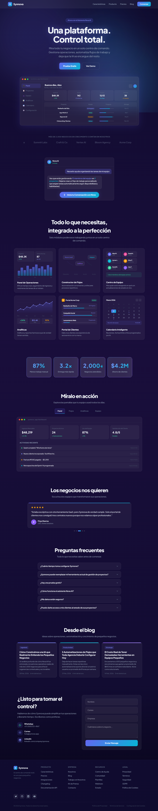

# Design #04 — Glass Command Center

> Glassmorphism Dashboard Landing Page

## Visual Identity / Aesthetic

Glass Command Center is a premium glassmorphism-driven design built around a deep indigo/purple atmosphere. The page feels like peering into a modern command center through frosted glass panels. Floating aurora blobs create an organic, living background, while a dot-grid texture adds subtle structure. The design heavily features interactive UI mockups (mini dashboards, workflow builders, calendars) embedded directly into the page as live-styled components. The overall mood is sophisticated, modern, and product-focused.

## Color Palette

| Role | Color | Hex |
|------|-------|-----|
| Background (top) | Deep indigo | `#0f0b2e` |
| Background (mid) | Dark purple | `#1a0e3c` |
| Primary accent | Indigo | `#6366f1` |
| Primary accent (light) | Light indigo | `#818cf8` |
| Secondary accent | Cyan | `#06b6d4` |
| Secondary accent (light) | Light cyan | `#22d3ee` |
| Tertiary accent | Violet | `#8b5cf6` / `#a78bfa` |
| Body text | Light slate | `#f1f5f9` |
| Secondary text | Muted slate | `#94a3b8` |
| Tertiary text | Dark slate | `#64748b` |
| Dimmest text | Darkest slate | `#475569` |
| Glass background | White 5% | `rgba(255, 255, 255, 0.05)` |
| Glass background (strong) | White 8% | `rgba(255, 255, 255, 0.08)` |
| Glass border | White 10% | `rgba(255, 255, 255, 0.1)` |
| Success green | Emerald | `#34d399` |
| Warning amber | Amber | `#f59e0b` |
| Error red | Red | `#ef4444` |

Primary gradient: `linear-gradient(135deg, #6366f1, #06b6d4)` — used for CTAs, logo, progress bars, stat values, active indicators, and the sticky AI button.

## Typography

| Element | Font | Weight | Size |
|---------|------|--------|------|
| Headings | Plus Jakarta Sans | 800 (extra-bold) | `clamp(36px, 6vw, 68px)` hero; `clamp(28px, 4vw, 44px)` sections |
| Body text | Plus Jakarta Sans | 400–500 | 13–20px |
| Code/URLs | Fira Code | 400–500 | 11–12px |
| Nav links | Plus Jakarta Sans | 500 | 14px |
| CTA buttons | Plus Jakarta Sans | 600–700 | 14–16px |

Plus Jakarta Sans is the sole display/body font, providing a clean, geometric, highly modern feel with tight letter-spacing (`-0.02em` to `-0.03em`) on headings. Fira Code is used only for monospace elements like the macOS-style URL bars in mockups.

## Layout Patterns and Grid System

- **Max widths**: 1200px for nav, 1100px for features, 1060px for product/blog, 900px for stats/testimonials, 720px for FAQ
- **Grid**: CSS Grid with `repeat(auto-fit, minmax(280px, 1fr))` for features and blog (auto-responsive); `repeat(auto-fit, minmax(180px, 1fr))` for stats; `repeat(auto-fit, minmax(320px, 1fr))` for contact
- **Spacing**: Inline styles with padding `60px 24px 80px` per section (consistent)
- **Section flow**: Sections stack vertically with no explicit dividers — the aurora blobs and glass cards provide visual separation
- **All styling is inline**: Unlike Design 1 (Tailwind), Design 4 uses predominantly inline `style={{}}` props with a single `<style>` block for animations and utility classes

## Sections — Detailed Breakdown

---

### 1. Navigation

- **Position**: Sticky top, full-width, `z-50`, uses `.d4-glass` class (no border-radius, no side/top borders)
- **Layout**: `max-width: 1200px` centered, flexbox `justify-between`, `padding: 14px 24px`, wraps on small screens (`flexWrap: wrap, gap: 12`)
- **Left — Logo**: 34px rounded square (`border-radius: 10px`) with indigo→cyan gradient + bold white "S", next to "Synnova" wordmark (700 weight, 20px, `letter-spacing: -0.02em`)
- **Right — Links + CTA**: 4 nav links — Características, Producto, Precios, Blog — in 14px, 500 weight, `#94a3b8` text → `#f1f5f9` on hover (inline `onMouseEnter`/`onMouseLeave`). "Comenzar" button with gradient fill, `border-radius: 10px`, `padding: 8px 20px`, 14px 600 weight
- **No mobile hamburger**: Links wrap naturally via flexbox. No separate mobile menu

---

### 2. Hero Section

- **Padding**: `80px 24px 40px`, centered text, `z-index: 1`
- **Content** (all within `d4-fade-up`, `max-width: 700px`):
  1. **Badge pill**: "Ahora con el Asistente Nova AI" — `border-radius: 999px`, `rgba(99,102,241,0.15)` bg with `rgba(99,102,241,0.25)` border, `#818cf8` text, 13px 600 weight
  2. **Headline**: "Una plataforma. / Control total." — `clamp(36px, 6vw, 68px)`, 800 weight, `line-height: 1.08`, `letter-spacing: -0.03em`, `.d4-glow-text` class adds indigo text-shadow glow (`0 0 40px rgba(129,140,248,0.35), 0 0 80px rgba(99,102,241,0.2)`)
  3. **Subheadline**: "Mira todo tu negocio en un solo centro de comando..." — `clamp(16px, 2vw, 20px)`, 400 weight, `#94a3b8`, `max-width: 540px`, `line-height: 1.6`
  4. **CTA pair**: "Prueba Gratis" (gradient fill, `border-radius: 12px`, `padding: 14px 32px`, 700 weight, `box-shadow: 0 0 30px rgba(99,102,241,0.35)`) + "Ver Demo" (ghost, white 15% border, transparent bg)
- **Hero Dashboard Mockup** (`d4-fade-up d4-float`, `max-width: 960px`, `perspective: 1200px`, `margin-top: 60px`):
  - `HeroDashboardMockup` component — `.d4-glass-strong` wrapper with `box-shadow: 0 8px 60px rgba(99,102,241,0.18)`
  - **macOS title bar**: red/yellow/green 12px dots + `synnova.app/dashboard` in Fira Code 11px, `#475569`
  - **Sidebar** (180px): 6 menu items — Panel (active, `rgba(99,102,241,0.15)` bg, `#818cf8` text), Proyectos, Equipo, Analíticas, Calendario, Configuración — each with emoji icon, 13px
  - **Main area**: Greeting header ("Buenos días, Alex" + date) → 4 KPI cards in 4-col grid (Ingresos $48.2K +12%, Tareas 142/23 abiertas, Equipo 12/12 En línea, Clientes 38 +4 nuevos) → Data table with 4 project rows (columns: Proyecto, Estado, Progreso bar, Entrega)
  - Animated `d4FloatUI 6s` gentle vertical float

---

### 3. Trust Bar

- **Padding**: `40px 24px 48px`, centered
- **Label**: "Más de 2,000 negocios en crecimiento confían en nosotros" — 13px, 600 weight, `#64748b`, uppercase, `letter-spacing: 0.08em`
- **Marquee**: `max-width: 900px`, overflow hidden, `.d4-marquee-track` with `d4Marquee 30s linear infinite`
- **Companies** (doubled for seamless loop): Acme Corp, TechFlow, Horizon Digital, Bright Studio, NextWave, Pulse Media, Summit Labs, Craft & Co, Vertex AI, Bloom Agency — 18px, 700 weight, `rgba(148,163,184,0.35)`, `padding: 0 36px` each

---

### 4. AI Chat Preview Section

- **ID**: `#ai`
- **Padding**: `60px 24px 80px`
- **Layout**: `max-width: 560px` centered, single `.d4-glass` card
- **Card structure**:
  - **Chat header**: 32px gradient circle with "N" initial + "Nova AI" name + "En línea" green status dot (`#34d399`, 11px)
  - **Chat messages** (column, `gap: 14px`):
    - **User bubble** (right-aligned): "Necesito ayuda organizando las tareas de mi equipo" — `border-radius: 14px 14px 4px 14px`, `rgba(99,102,241,0.25)` bg, 14px
    - **Nova bubble** (left-aligned): Contextual response with highlighted spans ("12 miembros del equipo" in `#818cf8`, "3 proyectos" in `#06b6d4`) + animated typing cursor (`.d4-typing::after` with `d4Blink 1s step-end infinite`) — `border-radius: 14px 14px 14px 4px`, `rgba(255,255,255,0.06)` bg with matching border
  - **CTA button**: "Inicia tu Conversación con Nova" — gradient pill (`border-radius: 999px`), 700 weight, 15px, glow shadow. Includes mic icon SVG (16px) with `.d4-pulse-ring` expanding outward (`d4Pulse 2s ease-out infinite`, indigo border)

---

### 5. Features — Bento Grid

- **ID**: `#features`
- **Padding**: `60px 24px 80px`, `max-width: 1100px`
- **Header** (`d4-fade-up`): "Todo lo que necesitas, / integrado a la perfección" — `clamp(28px, 4vw, 44px)`, 800 weight + subtitle "Seis módulos poderosos..." in `#94a3b8`, 17px
- **Grid** (`d4-fade-up`): `repeat(auto-fit, minmax(280px, 1fr))`, `gap: 24px`
- **6 feature cards**, each a `.d4-glass` with `.d4-blog-card` hover class (lift -6px + glow shadow):

  1. **Panel de Operaciones** (`MiniDashboard`):
     - 2-col KPI grid: Ingresos $48.2K (+12%) and Tareas Hechas 87/142
     - 12-bar vertical chart with indigo→cyan gradient fill, 100px height
     - X-axis labels: Ene, Jun, Dic
     - Description: "KPIs en tiempo real, seguimiento de ingresos y resúmenes de tareas de un vistazo."

  2. **Constructor de Flujos** (`MiniWorkflow`):
     - 4 workflow nodes positioned absolutely: "Nuevo Lead" (indigo), "Calificar" (violet), "Asignar" (cyan), "Seguimiento" (green)
     - SVG connector lines (dashed, colored) between nodes in a zigzag pattern
     - Bottom labels: Disparador, Acción, Acción, Acción
     - 200px height container
     - Description: "Automatización con arrastrar y soltar para procesos repetitivos."

  3. **Centro de Equipo** (`MiniTeamHub`):
     - 6 team member pills in flex wrap: Alex M. (Líder, indigo), Sarah K. (Diseño, pink), James L. (Dev, cyan), Nina P. (Marketing, amber), David R. (Ventas, green), Lisa T. (Soporte, violet) — each with 28px avatar circle with initial + status dot (online green/away amber/offline gray) + name + role
     - Status bar: "5 de 6 miembros del equipo activos" — green-tinted bg with green border
     - Description: "Mira quién está trabajando en qué con actualizaciones de estado en vivo."

  4. **Analíticas** (`MiniAnalytics`):
     - SVG line chart (300×120 viewBox) with gradient area fill, indigo line + dots, horizontal grid lines
     - X-axis labels: Ene, Mar, Jun, Sep, Dic
     - 3 metric pills below: +24% Crecimiento (green), $12.4K MRR (indigo), 92% Retención (amber)
     - Description: "Gráficos y reportes hermosos que de verdad tienen sentido."

  5. **Portal de Clientes** (`MiniClientPortal`):
     - Header: amber "A" avatar + "Portal Acme Corp" + "Activo" green badge
     - 3 project rows with progress bars: Rediseño de Marca (65%), Campaña Social (90%), Lanzamiento Web (20%) — indigo→cyan gradient fill bars
     - Description: "Dale a tus clientes una experiencia de autoservicio con tu marca."

  6. **Calendario Inteligente** (`MiniCalendar`):
     - Month header: "Marzo 2026" + prev/next nav arrows
     - 7-col day grid (L M M J V S D) + 4 weeks of dates
     - Today (4th) highlighted with gradient circle. Event dots (indigo, 4px) on dates 4, 7, 11, 15, 18
     - Previous month dates dimmed (`#334155`)
     - Upcoming event bar: "Reunión de equipo — 9:00 AM" in indigo tint
     - Description: "Reuniones, fechas límite e hitos programados por IA."

- **Card padding**: `clamp(14px, 2.5vw, 24px)`, content area `min-height: clamp(200px, 25vw, 260px)`

---

### 6. Stats Section

- **Padding**: `60px 24px 80px`, `max-width: 900px`
- **Grid** (`d4-fade-up`): `repeat(auto-fit, minmax(180px, 1fr))`, `gap: 18px`
- **4 stat cards**, each wrapped in `.d4-gradient-border` (animated gradient border via `::before` pseudo-element with `mask-composite: exclude`, `d4GradBorder 4s`):
  1. **87%** — "Menos trabajo manual"
  2. **3.2x** — "Entrega más rápida"
  3. **2,000+** — "Negocios atendidos"
  4. **$4.2M** — "Ahorro para clientes"
- **Value styling**: `clamp(32px, 5vw, 44px)`, 800 weight, gradient text fill (`#818cf8 → #06b6d4`)
- **Card inner**: `.d4-glass-strong`, `padding: 32px 20px`, centered text, `border-radius: 15px`

---

### 7. Product Showcase — Tabbed

- **ID**: `#product`
- **Padding**: `40px 24px 80px`, `max-width: 1060px`
- **Header** (`d4-fade-up`): "Míralo en acción" — `clamp(28px, 4vw, 40px)` + subtitle "Explora las pantallas que tu equipo usará todos los días."
- **Tab bar** (`d4-fade-up`): 4 buttons in flex row with wrap — Panel, Flujos, Analíticas, Equipo. Active tab: `rgba(99,102,241,0.15)` bg + `rgba(99,102,241,0.3)` border + `#f1f5f9` text + `.d4-active` underline (scaleX 0→1). Inactive: transparent bg, `#64748b` text. `border-radius: 10px`, `padding: 8px 22px`
- **Mockup frame** (`d4-fade-up`): `.d4-glass` card with:
  - **macOS title bar**: 12px red/yellow/green dots + `synnova.app/{activeTab}` in Fira Code 12px, `#64748b`
  - **Content area**: `padding: 24px`, `min-height: 360px`, switches between:

  **TabDashboard**:
  - 4 KPI cards (auto-fit grid, minmax 140px): Ingresos Mensuales $48,219 (+12.3%), Proyectos Activos 24, Uso del Equipo 87%, Satisfacción del Cliente 4.8/5
  - "Actividad Reciente" list: 4 activity rows with colored dot + text + time — "Sarah completó 'Wireframe de inicio'" (2 min), "Nuevo cliente incorporado: TechFlow Inc." (18 min), "Factura #1042 pagada — $3,200" (1 hora), "Retrospectiva del Sprint 14 programada" (2 horas)

  **TabWorkflows**:
  - Header: "Flujo de Onboarding de Clientes" + "Activo" green badge + "Última ejecución: hace 3 horas"
  - 6-step workflow chain: Solicitud Cliente (Disparador, indigo) → Asignar Agente (Acción, violet) → Crear Tarea (Acción, cyan) → Notificar Equipo (Acción, light cyan) → Seguir Progreso (Monitor, green) → Enviar Actualización (Salida, amber) — connected by → arrow SVGs
  - Bottom: execution stats grid (4 cols) — 142 ejecuciones / 98.2% tasa éxito / 2.4 min promedio / 12 activos hoy

  **TabAnalytics**:
  - 3 KPI cards: MRR $12,480 (+8.2%), Churn 2.1% (-0.3%), LTV $4,820 (+12%)
  - SVG area chart (300×140) with indigo gradient area fill + line + dots
  - Legend row: Ingresos (indigo) + Gastos (cyan dashed)

  **TabTeam**:
  - 6 team member rows in 2-col grid: name + role + status badge (En línea green, Ausente amber, Offline gray) + task count + availability bar

---

### 8. Testimonials — Carousel

- **Padding**: `40px 24px 80px`, `max-width: 900px`
- **Header** (`d4-fade-up`): "Los negocios nos quieren" + subtitle "Escucha a los equipos que transformaron sus operaciones."
- **Carousel** (`d4-fade-up`): Overflow hidden container with flex row, `transform: translateX(-${idx * 100}%)`, `transition: 0.5s ease`. Auto-advances every 6000ms via `setInterval`
- **4 testimonial slides**, each full-width:
  1. Rachel Torres — Fundadora, Bright Studio (`#ec4899` avatar)
  2. Marcus Chen — Líder de Operaciones, TechFlow (`#06b6d4` avatar)
  3. Priya Sharma — CEO, Vertex Solutions (`#8b5cf6` avatar)
  4. David Okafor — Director de Proyectos, Horizon Digital (`#f59e0b` avatar)
- **Card styling**: `.d4-glass` with 3px gradient top bar (`linear-gradient(90deg, #6366f1, #06b6d4)`), `padding: 28px 28px 24px`
- **Card content**: 5 gold star icons (18px, `#f59e0b` fill) → quote text (16px, `line-height: 1.7`, `#e2e8f0`) → avatar circle (42px, colored bg, initial) + name (14px, 600) + role/company (12px, `#94a3b8`)
- **Dot navigation**: Row of 4 buttons — active dot: 24px wide, gradient fill. Inactive: 8px wide, `rgba(255,255,255,0.15)`. `border-radius: 4px`, `transition: 0.3s ease`

---

### 9. FAQ Section

- **Padding**: `40px 24px 80px`, `max-width: 720px`
- **Header** (`d4-fade-up`): "Preguntas frecuentes" + subtitle "Todo lo que necesitas saber antes de comenzar."
- **Accordion** (`d4-fade-up`): Vertical stack, `gap: 10px`
- **6 FAQ items**, each a `.d4-glass` card with `cursor: pointer`:
  1. ¿Cuánto tiempo toma configurar Synnova? — <30 min setup
  2. ¿Synnova puede reemplazar mi herramienta actual? — Full PM + CRM + analytics
  3. ¿Hay una prueba gratis? — 14-day free trial, plans from $29/mo
  4. ¿Cómo funciona el asistente Nova AI? — Context-aware AI assistant
  5. ¿Pueden migrar nuestros datos? — Built-in importers
  6. ¿Synnova funciona para equipos remotos? — Real-time collaboration
- **Accordion behavior**: Click toggles `openFaq` state. Active: border color `rgba(99,102,241,0.3)`, question text `#818cf8`, chevron rotated 180°. Answer body: `.d4-accordion-body` with `max-height: 0` → `400px` transition (0.4s ease), `padding: 0 20px 16px`, 14px, `line-height: 1.7`, `#94a3b8`

---

### 10. Blog Section

- **ID**: `#blog`
- **Padding**: `40px 24px 80px`, `max-width: 1060px`
- **Header** (`d4-fade-up`): "Desde el blog" + subtitle "Ideas sobre operaciones, automatización y crecimiento de pequeños negocios."
- **Grid** (`d4-fade-up`): `repeat(auto-fit, minmax(280px, 1fr))`, `gap: 18px`
- **3 blog cards**, each `.d4-glass` with `.d4-blog-card` hover:
  1. **Ingeniería** — "Cómo Construimos una IA que Realmente Entiende los Pequeños Negocios" — 28 Feb 2026, 6 min — gradient bar: `#6366f1 → #818cf8`
  2. **Productividad** — "5 Automatizaciones de Flujos que Toda Agencia Debería Configurar Hoy" — 21 Feb 2026, 4 min — gradient bar: `#06b6d4 → #22d3ee`
  3. **Estrategia** — "El Costo Real de Tener Demasiadas Herramientas en Equipos Pequeños" — 14 Feb 2026, 5 min — gradient bar: `#8b5cf6 → #a78bfa`
- **Card structure**: 4px colored gradient top bar → `padding: 22px` content area → category badge (indigo-tinted pill, 11px) → title (17px, 700 weight, `line-height: 1.35`) → excerpt (13px, `#94a3b8`, `line-height: 1.6`) → date + read time row (12px, `#64748b`)

---

### 11. Contact Section

- **Padding**: `60px 24px 80px`, gradient overlay bg (`linear-gradient(180deg, rgba(15,11,46,0), rgba(10,6,30,0.8))`)
- **Grid** (`d4-fade-up`): `max-width: 1000px`, `repeat(auto-fit, minmax(320px, 1fr))`, `gap: 40px`

  **Left column — Info**:
  - Heading: "¿Listo para tomar el control?" — `clamp(28px, 4vw, 40px)`, 800 weight
  - Description: "Hablemos de cómo Synnova puede simplificar tus operaciones..." — `#94a3b8`, 16px, `line-height: 1.7`
  - 3 contact methods, each with 42px icon box (`border-radius: 12px`, `rgba(99,102,241,0.12)` bg + `rgba(99,102,241,0.2)` border):
    1. WhatsApp — SVG icon + "+57 300 123 4567"
    2. Correo — SVG icon + "hola@synnova.app"
    3. Ubicación — SVG icon + "Bogotá, Colombia"

  **Right column — Form** (`.d4-glass`, `padding: 28px`):
  - 3 text inputs: Nombre, Correo (type email), Empresa — `border-radius: 10px`, `rgba(255,255,255,0.04)` bg, `rgba(255,255,255,0.1)` border → `rgba(99,102,241,0.5)` on focus, `padding: 14px 16px`, 14px
  - Textarea: "Cuéntanos sobre tu negocio..." — 4 rows, same styling, `resize: vertical`
  - Submit: "Enviar Mensaje" — gradient fill, `border-radius: 12px`, `padding: 14px 24px`, 700 weight, 15px

---

### 12. Footer

- **Border-top**: `1px solid rgba(255,255,255,0.06)`, `padding: 48px 24px 32px`
- **Layout**: `max-width: 1060px`, `repeat(auto-fit, minmax(160px, 1fr))` grid, `gap: 36px`
- **Brand column**: 30px gradient square logo icon + "Synnova" wordmark (18px, 700) + tagline (13px, `#64748b`)
- **3 link columns**: Producto (5 links), Empresa (5 links), Recursos (5 links) — uppercase 13px 700 weight title (`#64748b`) + 14px link list (`#94a3b8` → `#f1f5f9` on hover)
- **Social row**: 4 social icon buttons (36px, `border-radius: 10px`, `rgba(255,255,255,0.06)` bg + 8% border) → `rgba(99,102,241,0.15)` bg on hover — Twitter/X, LinkedIn, GitHub, Instagram
- **Bottom bar**: Divider + flex row: copyright "© 2026 Synnova" + 3 legal links (Política de Privacidad, Términos de Servicio, Configuración de Cookies) — 12px, `#475569`

---

### 13. Sticky AI CTA Button

- **Position**: Fixed `bottom: 28px`, `right: 28px`, `z-index: 100`
- **Visibility**: Appears when `scrollY > 900`, hidden class adds `opacity: 0`, `pointer-events: none`, `translateY(20px)`. `transition: 0.4s ease`
- **Design**: 56px circle button, gradient fill (`#6366f1 → #06b6d4`), white chat bubble SVG icon (24px), `box-shadow: 0 4px 24px rgba(99,102,241,0.4)`. `.d4-pulse-ring` expanding outward (indigo border, `inset: -4px`)

## Animation and Interaction Patterns

| Animation | Description | Duration/Timing |
|-----------|-------------|-----------------|
| `d4Float1–4` | Aurora blob movement + scale | 20–30s ease-in-out infinite |
| `d4FloatUI` | Hero mockup gentle float | 6s ease-in-out infinite |
| `d4Marquee` | Trust bar horizontal scroll | 30s linear infinite |
| `d4Pulse` | Pulse ring expanding outward | 2s ease-out infinite |
| `d4GradBorder` | Gradient border position cycling (stats) | 4s ease infinite |
| `d4Blink` | Typing cursor blink | 1s step-end infinite |
| Scroll fade-up (`d4-fade-up`) | Elements fade + translate up on IntersectionObserver (threshold 0.12) | 0.7s ease |
| Accordion (`d4-accordion-body`) | Max-height transition for FAQ | 0.4s ease |
| Blog card hover | translateY(-6px) + box-shadow glow | 0.3s ease |
| Tab underline | scaleX(0) → scaleX(1) on active | 0.3s ease |
| Testimonial carousel | translateX transition on index change | 0.5s ease |
| Auto-advance testimonials | Carousel index increments | Every 6000ms |
| Sticky CTA | Opacity + translateY fade in/out | 0.4s ease |

## Key Components and Styling Approach

- **Glass cards (`.d4-glass`)**: `background: rgba(255,255,255,0.05)`, `backdrop-filter: blur(24px)`, `border: 1px solid rgba(255,255,255,0.1)`, `border-radius: 16px`
- **Glass strong (`.d4-glass-strong`)**: Same but 8% white bg, 32px blur, 12% border — used for prominent panels
- **Gradient border cards**: Wrapper with `::before` pseudo-element using `background: linear-gradient(...)` + CSS `mask-composite: exclude` to create animated gradient borders
- **CTA buttons**: `border-radius: 12px` (not fully round), gradient fill, font-weight 700, box-shadow glow `0 0 30px rgba(99,102,241,0.35)`
- **Ghost buttons**: Transparent bg, white 15% border, light text
- **Form inputs**: `rgba(255,255,255,0.04)` bg, white 10% border, indigo 50% border on focus
- **Mini component mockups**: Self-contained sub-components (MiniDashboard, MiniWorkflow, etc.) with their own internal layouts, bar charts, line charts, SVG connectors, calendar grids, team member lists — all styled with inline styles
- **Hero dashboard mockup**: Full sidebar + main area layout with KPI cards, data table with progress bars, macOS title bar
- **Tab system**: Button-based tabs with active state (indigo bg + border), content switches via conditional rendering
- **Testimonial carousel**: Flexbox with `translateX(-${idx * 100}%)`, dot navigation with width expansion on active

## Background / Texture Effects

- **Aurora blobs**: 4 fixed-position, absolutely-placed circles (400–700px) with radial gradients in indigo/cyan/violet, `filter: blur(120px)`, `opacity: 0.18`, each with unique float animation. On mobile, reduced to `opacity: 0.1` and `blur(80px)` with smaller sizes
- **Dot grid (`.d4-dot-grid`)**: Fixed full-screen overlay with `radial-gradient(rgba(255,255,255,0.04) 1px, transparent 1px)` at 28px spacing — subtle structural texture
- **Background gradient**: `linear-gradient(180deg, #0f0b2e 0%, #1a0e3c 40%, #0f0b2e 100%)` — creates a darker-lighter-darker vertical sweep
- **Glow text**: `text-shadow: 0 0 40px rgba(129,140,248,0.35), 0 0 80px rgba(99,102,241,0.2)` on hero heading
- **Contact section gradient overlay**: `linear-gradient(180deg, rgba(15,11,46,0), rgba(10,6,30,0.8))` — fades to darker at bottom

## Responsive Behavior

- **Breakpoints**: Handled via `auto-fit` grids with minmax and `clamp()` font sizes — no explicit Tailwind breakpoints
- **Navigation**: Links wrap with `flexWrap: wrap, gap: 12`
- **Aurora blobs on mobile** (`max-width: 768px`): Reduced opacity (0.1), reduced blur (80px), smaller sizes (180–300px)
- **Features grid**: `minmax(280px, 1fr)` — naturally collapses from 3 → 2 → 1 columns
- **Stats grid**: `minmax(180px, 1fr)` — 4 → 2 → 1 columns
- **Product mockup**: Internal grid `minmax(140px, 1fr)` adapts KPI cards
- **Contact**: `minmax(320px, 1fr)` — 2-col → 1-col
- **Font sizes**: All headings use `clamp()` for fluid scaling (e.g., `clamp(36px, 6vw, 68px)`)
- **Card padding**: Uses `clamp(14px, 2.5vw, 24px)` for responsive internal spacing
- **Custom scrollbar**: Thin 6px width, subtle white tracks and thumbs

## Screenshot

